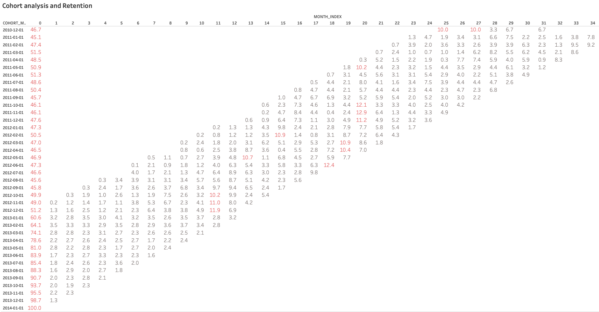
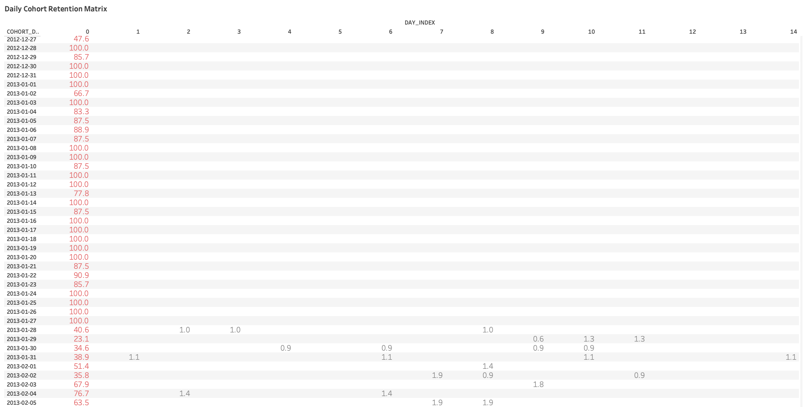

# Cohort analysis and Retention

Retention is the ultimate measure of product value. By employing Monthly and Daily Cohort Analysis, I provide the business with a granular view of the customer lifecycle. This approach transforms raw data into actionable intelligence, allowing us to mitigate churn, refine our targeting, and ultimately drive compounded growth.


## 1. Monthly Cohort Analysis and Retention 

This matrix demonstrates a consistent upward trajectory in initial user engagement, surpassing the 90% threshold by late 2013. Such a significant improvement strongly indicates that customer acquisition strategies have been effectively refined and targeted over time, leading to higher-quality user inflow.



```sql
WITH first_purchase AS (
    SELECT
            customer_key, 
            DATE_TRUNC('month',MIN(order_date)) as cohort_month
      FROM PORTFOLIO.DEV_GOLD.FACT_SALES
     GROUP BY 1 )

, activity AS (
    SELECT 
            t1.customer_key,
            t2.cohort_month,
            date_trunc('month', t1.order_date) as order_month,
            datediff('month', cohort_month, order_month) as month_index,
            t1.sales_amount
      FROM PORTFOLIO.DEV_GOLD.FACT_SALES t1
      LEFT JOIN first_purchase t2 ON t1.customer_key = t2.customer_key )

SELECT 
        cohort_month,
        month_index,
        COUNT(DISTINCT customer_key) as active_user, 
        SUM(sales_amount) as total_rev,
        total_rev / active_user as rev_per_user
FROM activity
GROUP BY 1,2
ORDER BY 1,2
```

## 2. Daily Cohort Retention Matrix

A granular examination of daily cohorts reveals considerable volatility in short-term retention. Although certain dates achieved 100% initial engagement—with a notable strengthening of this trend since early 2013—the subsequent sharp decline underscores a critical drop-off point immediately following the first purchase. This highlights a clear opportunity for optimising post-purchase re-engagement strategies.



```sql
WITH first_purchase AS (
    SELECT
            customer_key, 
            DATE_TRUNC('day',MIN(order_date)) as cohort_day
      FROM PORTFOLIO.DEV_GOLD.FACT_SALES
     GROUP BY 1 )

, activity AS (
    SELECT 
            t1.customer_key,
            t2.cohort_month,
            date_trunc('day', t1.order_date) as order_day,
            datediff('day', cohort_day, order_day) as day_index,
            t1.sales_amount
      FROM PORTFOLIO.DEV_GOLD.FACT_SALES t1
      LEFT JOIN first_purchase t2 ON t1.customer_key = t2.customer_key )

SELECT 
        cohort_day,
        day_index,
        COUNT(DISTINCT customer_key) as active_user, 
        SUM(sales_amount) as total_rev,
        total_rev / active_user as rev_per_user
FROM activity
GROUP BY 1,2
ORDER BY 1,2
```
